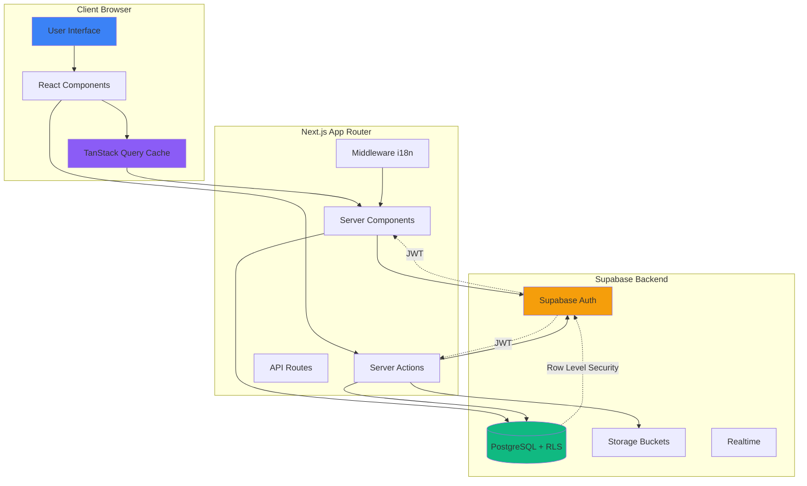
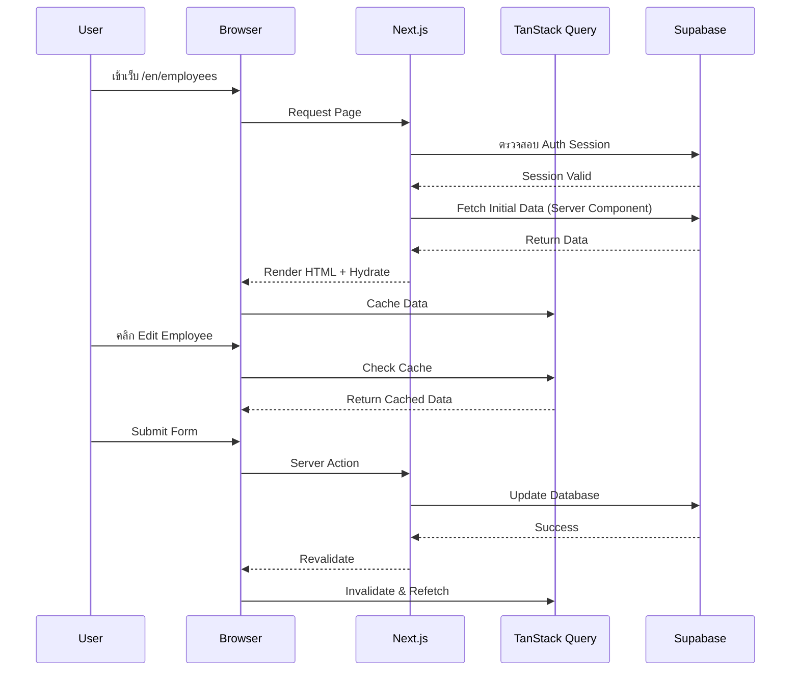
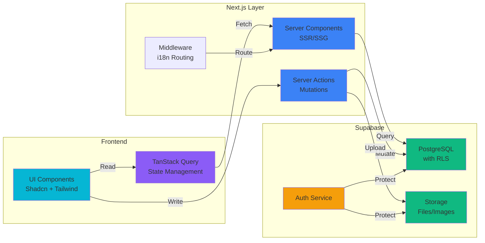
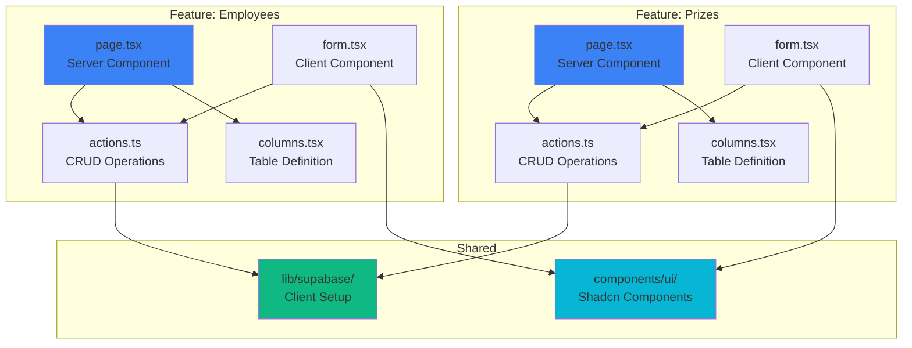
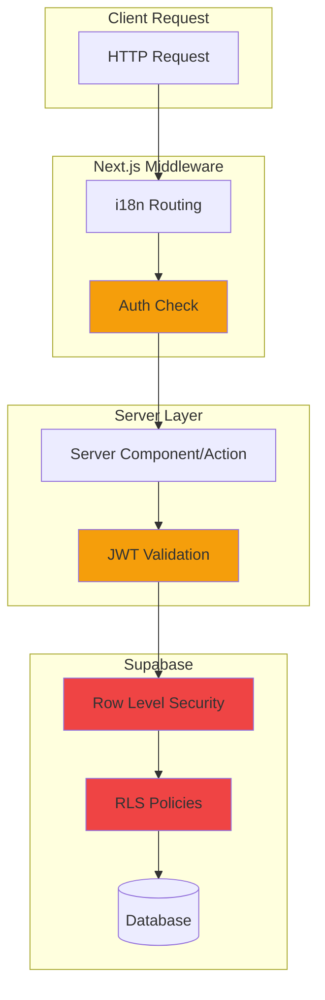
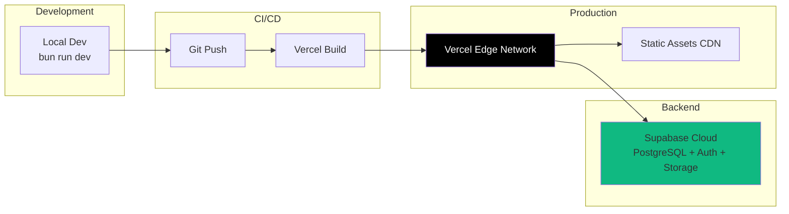
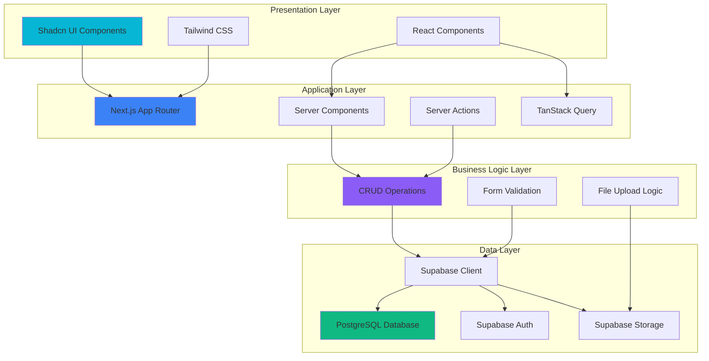

# NST Stack Architecture

## System Architecture

## Application Flow

## Data Flow Architecture

## Feature Module Structure

## Security Architecture

## Deployment Architecture

## Technology Stack Layers

